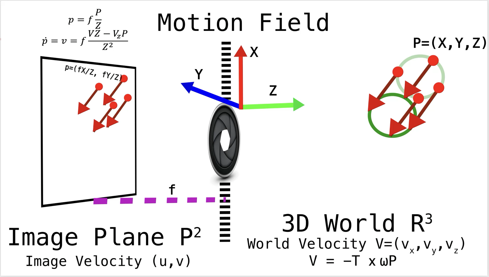
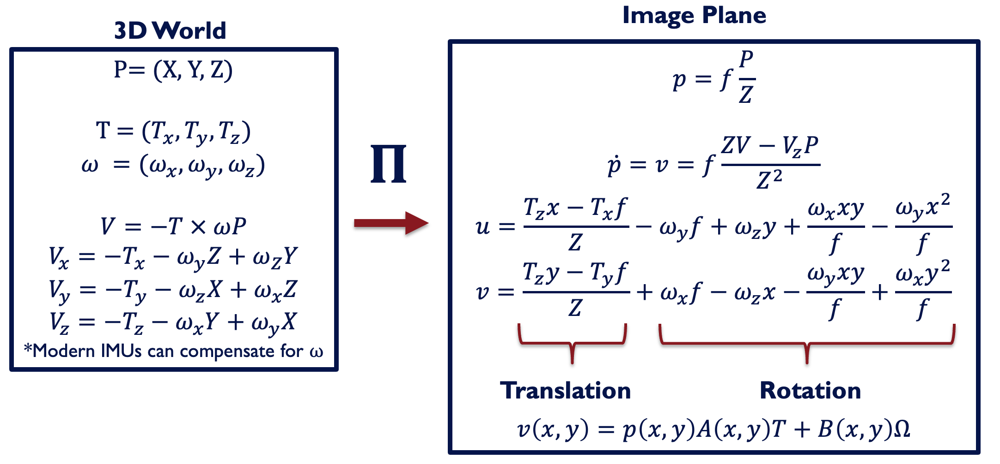

## Egomotion Recovery
<a target="_blank" href="https://colab.research.google.com/github/anthonytec2/heeger_jepson/blob/main/egomotion.ipynb">
  
</a> 

*tldr: How to recover egomotion: translational, rotational motion along with depth up to a scale from optical flow*

This repository is dedicated to implementing David Heeger and Alan Jepson's method: "Subspace Methods for Recovering Rigid Motion".


### Introduction
In typical scenes two types of motion are present: 1) egomotion which is the camera's motion and 2) independently moving objects. In many scenarios(robot navigation, scene reconstruction, etc) it is important to recover egomotion from a video sequence. The method implemented here is one such method to recover the egomotion using optical flow between images. The below will review the connection between egomotion and optical flow, and showcase how to resolve a solution. 

## Motion Field Equation

### 3D Motion



We start with a review of 3D motion, lets assume we have a point P in 3D with coordinates (X,Y,Z). Assuming this point P is part of a [rigid body](http://www.springer.com/us/book/9780387008936#otherversion=9781441918468), we can describe its motion at a future time point as: $\hat{P}(t)=R(t)P+W(t)$, where R describes a rotation of the original point and W describes a translation as a function of t of the rigid body. We can model the displacement as:  

``` math
\begin{split}
  d & = RP+W-P \\
    & = (I+S)P+W-P \\
    & = SP+W  \\
    &S=\begin{pmatrix}
    0 & -\theta_z & \theta_y\\
    \theta_z & 0 & -\theta_x\\
    -\theta_y & \theta_x & 0
    \end{pmatrix}\\
    & V=-T-\Omega \times P
\end{split}
```
On line 2 of this derivation, we use the small angle approximation to approximate a rotation matrix as I+S, where S is the small angle approximation of rotation. This full derivation, which we use, can be found in Robert Collins [CSE486 lectures](https://www.cse.psu.edu/~rtc12/CSE486/lecture22_6pp.pdf). Under the limit, this displacement becomes velocity bringing us to the final equation line. T indicates the translational velocity, $\Omega$ indicates the rotational velocity and V indicates the velocity. $SP=\Omega \times P$ in the final equation results from the fact we write a skew symmetric matrix times a vector as a cross product. We flip the sign here to indicate the velocity of the point with respect to the camera. 


### 3D Motion Project onto 2D
We view the point movement from a camera assuming a [pinhole projection](https://www.youtube.com/watch?v=_EhY31MSbNM). The pinhole project models the projection of the scene through an infinitesimal hole, where this projection can be modeled via  pair of similar triangles: $\frac{X}{Z}=\frac{x}{f}$, $\frac{Y}{Z}=\frac{y}{f}$, where x,y are the pixel coordinates and f is the focal length of the camera. This gives us an equation of the pixel coordinates as, $x=\frac{fX}{Z}, y=\frac{fY}{Z}$. Hence, we can write the projection of point P as:
``` math
p=(x,y,1)=KP=\begin{pmatrix}
f & 0 & 0 \\
0 & f & 0 \\
0 & 0 & 1
\end{pmatrix}\begin{pmatrix}
X\\
Y\\
Z
\end{pmatrix}
```
We now will describe the motion field equation which shows how $T, \Omega$ and Z create $\dot{p}$:
``` math
  \begin{split}
  \dot{p}& =v=f\frac{VZ-V_zP}{Z^2} \\
  &=\frac{1}{Z}\begin{pmatrix}
   -f & 0 & x\\
  0 & -f & y 
  \end{pmatrix} T+\begin{pmatrix}
  (xy)/f & -(f+x^2/f) & y\\
  f+y^2/f & -(xy)/f & -x 
  \end{pmatrix}\Omega\\
  & = \frac{1}{Z}A(x,y)T +B(x,y)\Omega
\end{split}
```
where this is found by taking the derivative(using the quotient rule) of the projection equation noting X,Y,Z are functions of time. The final mapping between quantities in 3D and 2D can be found below:




### Optical Flow
We wish to observe and recover the entire motion field, but we cannot recover this from only image intensity information. This is due to the [aperture problem](https://en.wikipedia.org/wiki/Barberpole_illusion), or inability to recover the true motion direction due to a limited receptive field. Hence, we recover a close approximation to the motion field which is the optical flow, the direction of intensity changes in an image. Some methods solve for optical flow via a [continuity equation](https://en.wikipedia.org/wiki/Continuity_equation) assuming intensity is conserved along the motion direction. Therefore, one can write: $\frac{\partial I}{\partial x}u+\frac{\partial I}{\partial y}v=-\frac{\partial I}{\partial t}$, which shows the optical flow (u,v) can be found via estimating the spatial and temporal derivatives. A standard way to solve this using the [Lucas-Kanade method](https://www.ri.cmu.edu/pub_files/pub3/lucas_bruce_d_1981_1/lucas_bruce_d_1981_1.pdf) assuming local continuity of motion direction to create a least squares equation to solve for u,v. Estimation of the optical flow using this method can be inexact due to inexact derivative estimation or motions not following local continuity. Further methods have been developed using priors to overcome this limitation either hand-crafted or learned network-based. 

In the end, we now have the optical flow which has latent factors $(T, \Omega, Z)$, we now showcase a method to solve for these factors from the optical flow. 

### Heeger and Jepson Method
The Heeger and Jepson method presents one way to recover $(\Omega, T, \frac{1}{Z})$ from the optical flow measurements v. A few assumptions that we will make is first we assume ||T||=1, recovering our measurement only up to a scale since we are using a monocular setup. We start with formulating the motion field equation as a minimization of our measurements:  

``` math
\begin{align*}
e_i &= \min_{T,\Omega,\frac{1}{Z_i}} \left\| \frac{1}{Z_i} A(x, y) T + B \Omega - v_i \right\|_2 \\
% Factorize minimization + A(x, y) T = A(T) \\
&\stackrel{\text{Factorize}}{=} \min_{T, \Omega} \min_{\frac{1}{Z_i}}  \left\| \frac{1}{Z_i} A(T) + B \Omega - v_i \right\|_2 \\
% Assume known (T, Omega) solve for 1/Zi
&\text{Assume known } (T, \Omega) \text{, solve for } \frac{1}{Z_i} \\
& A(T) \frac{1}{Z_i} = v - B\Omega  \\
& \frac{1}{Z_i} = (A(T)^T A(T))^{-1} A(T)^T (v - B\Omega) \\
% Minimize (I-A(T)(A(T))^T A(T)^T)(v-B\Omega) \\
% This is just the orthogonal projection A(T)^\perp
&= \min \left( I - A(T) (A(T)^T A(T))^{-1} A(T)^T \right) (v - B\Omega) \\
&\quad\text{This is just the orthogonal projection } A(T)^\perp \\
% Minimize A^perp(T)^T(v-B\Omega)
&= \min_{T, \Omega} A^{\perp}(T)^T (v - B \Omega) \\
% LSQ Estimate: hat{\Omega}(t)
% Minimize ||A^perp(T)^T(B\hat{\Omega}(T)-v)||
&= \min_T ||A^{\perp}(T)^T (B \hat{\Omega}(T) - v)||_2
\end{align*}
```

Hence, we have transformed a problem of three variables into only a search over T. The nice part of the search over T is $T\in SO(2)$ allowing something as simple as brute force search algorithms for this minimization. After solving for T, $\Omega=\hat{\Omega}(T)$, and $\frac{1}{Z_i}$ can be solved for directly. Therefore through the Heeger and Jepson algorithm, one can recover the egomotion from the optical flow. In this repository, we will show some examples of how the above is implemented in code. 


### Implementation
We provide two files in this repository, one is a notebook to allow you to play around and easily understand the Heeger and Jepson method. The second is a library implementation you can use in order to call from Python in order to solve any ego-motion. All the implementations are done in Jax. Jax allows us to easily compile our code for efficient implementation on any available acceleration hardware. 

### Citation

```
@article{Heeger1992SubspaceMF,
  title={Subspace methods for recovering rigid motion I: Algorithm and implementation},
  author={David J. Heeger and Allan D. Jepson},
  journal={International Journal of Computer Vision},
  year={1992},
  volume={7},
  pages={95-117},
}
```


### Resources
- [Heeger, D.J., & Jepson, A.D. (1992). Subspace methods for recovering rigid motion I: Algorithm and implementation. International Journal of Computer Vision, 7, 95-117.](https://www.cs.toronto.edu/~jepson/papers/HeegerJepsonJCV1992.pdf)

- [Tian, T.Y., Tomasi, C., & Heeger, D.J. (1996). Comparison of approaches to egomotion computation. Proceedings CVPR IEEE Computer Society Conference on Computer Vision and Pattern Recognition, 315-320.](https://www.cns.nyu.edu/heegerlab/content/publications/Tian-CVPR96.pdf)

- [Daniilidis, K., & Spetsakis, M.E. (1996). Understanding noise sensitivity in structure from motion.](https://www.cis.upenn.edu/~kostas/mypub.dir/danispets.pdf)


- [Jaegle, A., Phillips, S., & Daniilidis, K. (2016). Fast, robust, continuous monocular egomotion computation. 2016 IEEE International Conference on Robotics and Automation (ICRA), 773-780.](https://arxiv.org/abs/1602.04886) [<Code\>](https://github.com/stephenphillips42/erl_egomotion/tree/master)

- [CIS 5800 University of Pennsylvania Kostas Daniilidis](https://drive.google.com/file/d/1v4amoLG4Lzr_gRHZSGst5649nDJUDRjf/view)

- [Trucco, E., & Verri, A. (1998). Introductory techniques for 3-D computer vision.](https://www.semanticscholar.org/paper/Introductory-techniques-for-3-D-computer-vision-Trucco-Verri/3e95b708f5f138252f84d8749a5b89cfb5c15dca)

- [Stephen Phillip's Thesis](https://drive.google.com/file/d/1wUP-Omrg68uT28eVGEwbyUL98ZebJ4kk/view)

